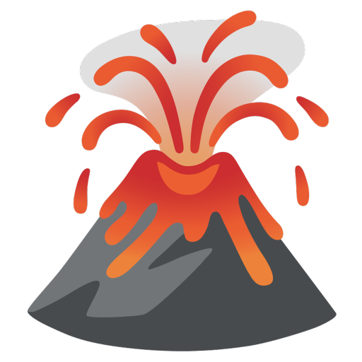

<!-- PROJECT SHIELDS -->
<!--
*** I'm using markdown "reference style" links for readability.
*** Reference links are enclosed in brackets [ ] instead of parentheses ( ).
*** See the bottom of this document for the declaration of the reference variables
*** for contributors-url, forks-url, etc. This is an optional, concise syntax you may use.
*** https://www.markdownguide.org/basic-syntax/#reference-style-links
-->
[![Contributors][contributors-shield]][contributors-url]
[![Forks][forks-shield]][forks-url]
[![Stargazers][stars-shield]][stars-url]
[![Issues][issues-shield]][issues-url]
[![MIT License][license-shield]][license-url]

<!-- PROJECT LOGO -->
 

  

<h3 align="center">Lava</h3>

  

    Multi funtion free & open source Discord music bot powered by Lavalink
     
    <a href="#About Project"><strong>Read more »</strong></a>
     
     
    <a href="README.md">中文</a>
    ·
     
    <a href="https://discord.gg/acgmcity">Try it out!(Chinese server)</a>
    ·
    <a href="https://github.com/Nat1anWasTaken/Lava/issues">Bug report</a>
    ·
    <a href="https://github.com/Nat1anWasTaken/Lava/issues">Request new features</a>
  

<!-- TABLE OF CONTENTS -->

  
Table of contents

  <ol>
    <li>
      <a href="#screenshots">Screenshots</a>
    </li>
    <li>
      <a href="#get-started">Get started</a>
      <ul>
        <li><a href="#spotify-support">Spotify Support</a></li>
        <li><a href="#requirements">Requirements</a></li>
      </ul>
    </li>
    <li><a href="#how-to-use">How to use</a></li>
    <li><a href="todo">ToDo</a></li>
    <li><a href="#license">License</a></li>
  </ol>

<!-- SCREENSHOTS -->

## Screenshots

![player][player-screenshot-en]

(<a href="#readme-top">Back to top</a>)

<!-- GETTING STARTED -->

## Get started

If you just want to experiment what the bot is like, you can join [Yeecord(Chinese)][yeecord] and use `Lava#8364` there

Or

You can [click here][LavaLauncher] to get the instructions on how to setup **Lavalink** and **Discord bot**

### Spotify Support

To use `Spotify` and `Autoplay` support, you need to fill in those ecorresponding environment variable explained aboved at step one.

### Requirements

* [Python 3.10+][python]

(<a href="#readme-top">Back to top</a>)

<!-- USAGE EXAMPLES -->

## Usage

After setting up the bot and invited it into your server, you can use `/play` to play music, as like in the example screenshot

Every command usage is explained in command description, you can learn how to use this bot by reading them

(<a href="#readme-top">Back to top</a>)

<!-- ROADMAP -->

## ToDo

- [ ] Add more platform
  - [x] YouTube
  - [x] Spotify
  - [x] SoundCloud
  - [x] Bilibili
  - [x] YouTube-DL
  - [ ] Apple Music
    ...
- [ ] Enhance stability

If you find any issues, you're more then welcome to mention it in [Issues][issues]

(<a href="#readme-top">Back to top</a>)

<!-- LICENSE -->

## License

This project is licensed under MIT License, check `LICENSE.txt` for more information

(<a href="#readme-top">Back to top</a>)

<!-- SHIELDS -->

[contributors-shield]: https://img.shields.io/github/contributors/Nat1anWasTaken/Lava.svg?style=for-the-badge

[contributors-url]: https://github.com/Nat1anWasTaken/Lava/graphs/contributors

[forks-shield]: https://img.shields.io/github/forks/Nat1anWasTaken/Lava.svg?style=for-the-badge

[forks-url]: https://github.com/Nat1anWasTaken/Lava/network/members

[stars-shield]: https://img.shields.io/github/stars/Nat1anWasTaken/Lava.svg?style=for-the-badge

[stars-url]: https://github.com/Nat1anWasTaken/Lava/stargazers

[issues-shield]: https://img.shields.io/github/issues/Nat1anWasTaken/Lava.svg?style=for-the-badge

[issues-url]: https://github.com/Nat1anWasTaken/Lava/issues

[license-shield]: https://img.shields.io/github/license/Nat1anWasTaken/Lava.svg?style=for-the-badge

[license-url]: https://github.com/Nat1anWasTaken/Lava/blob/master/LICENSE.txt

<!-- LINKS -->

[yeecord]: https://discord.gg/yeecord

[python]: https://python.org

[lavalink]: https://github.com/freyacodes/Lavalink

[LavaLauncher]: https://github.com/Nat1anWasTaken/LavaLauncher

[spotipy-authorization-flow]: https://spotipy.readthedocs.io/en/2.22.0/#authorization-code-flow

[issues]: https://github.com/Nat1anWasTaken/Lava/issues

<!-- IMAGES -->

[player-screenshot-en]: img/player-en.png
